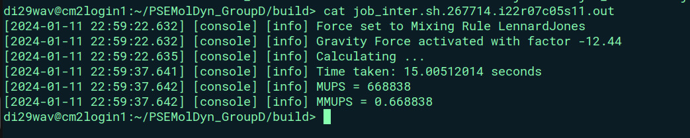

# Group D #
Members:
* Rodrigo Felix Forno
* Klára Možná
* Rayen Manai

# Code #
* Link:     https://github.com/klaramozna/PSEMolDyn_GroupD
* Branch:   contest1
* Revision: a1d8f584215b930e20848cb80b0dfc954d199435
* Compiler: g++ 11.4.0
* Documentation: https://klaramozna.github.io/PSEMolDyn_GroupD/
  
> **Hint 1:** The steps we followed to load dependencies on the cluster, compile our code and run it were already described on the report submitted for worksheet 4 (https://github.com/klaramozna/PSEMolDyn_GroupD/tree/presentations%2Breports/worksheet4/report). Here we are presenting the results for the contest 1.

> **Hint 2:** The serial partition of the cluster (serial_std) is overloaded and running a job there sometimes take days to give a result back, the results presented here were run on the inter partition (cm2_inter) 

# Results # 




### CoolMUC2  ###

* The used script to run that benchmarking:  
```
#!/bin/bash
#SBATCH -o ./%x.%j.%N.out
#SBATCH -D ./
#SBATCH --get-user-env
#SBATCH --clusters=inter
#SBATCH --partition=cm2_inter 
#SBATCH --mail-type=end
#SBATCH --mail-user=rayen.manai@tum.de
#SBATCH --export=ALL
#SBATCH --time=00:30:00

srun ./src/MolSim -p ../input/Contest1/contest1.xml -t True

``` 


