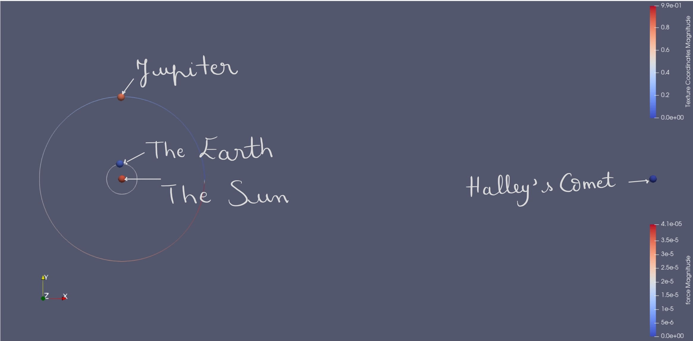

# Group D #
Members:
* Rodrigo Felix Forno
* Klára Možná
* Rayen Manai

# Code #
* Link:     https://github.com/klaramozna/PSEMolDyn_GroupD
* Branch:   main
* Revision:
* Compiler: 


# Report #
## Task 1 ”First steps” ##
* We had a look at the Student Starter Clues and identified the necessary tools for our project and devised a plan for the implementation. Additionally, we set up Git and created a repository on GitHub, incorporating a .gitignore file to prevent the unnecessary commit of documentation or binaries. After downloading the program frame from GitHub, we successfully compiled and executed it. Furthermore, we installed VTK/Paraview and Doxygen, utilizing Doxygen to create preliminary documentation for the code frame. Finally, we configured the project name in CMakeLists.txt as "PSEMolDyn_GroupD"
## Task 2 ”Completion of the program frame” ##
* We successfully implemented the fundamental steps of the molecular dynamics simulation algorithm by adhering to ```the Velocity-Störmer-Verlet``` formulas, as discussed in our meeting. To make our code more readable and simpler, we implemented the class ```VectorDouble``` class to perform the calculations of position, velocity and force, using operator overloading.
* We successfully created VTK output for visualization by utilizing the provided VTKWriter class within our project template. We instantiated it and integrated it into our simulation process. By doing so, we efficiently generated .vtu simulation files that encapsulate the essential data points.
* We incorporated command line parameterization into our project, utilizing the ```Boost Program Options``` library. By adopting this approach, we enabled users to specify simulation parameters, such as 't_end' (indicating the end time of the simulation), 'delta_t' (representing the time step interval) as well as the path to the input file, directly through the command line interface. We specified default values for delta_t and t_end so providing these arguments is optional and overrides those values. A detailled description can be found on the general README of our project on the main branch. Users can run ```./MolSim --help``` for an overview of supported options. 

## Task 3 ”Simulation of Halley’s Comet” ##
* Using the provided parameters, we managed to run the simulation from the input file and visualize the particles in Paraview with a glyph filter. Moreover, to enhance the visual representation, we added circles to track the trajectories of Earth and Jupiter. 


* We also provided a video of our result simulation:
  
https://github.com/klaramozna/PSEMolDyn_GroupD/assets/101558922/00c0e27b-faaa-46da-9583-b0e2a427c47a



## Task 4 ”Refactoring and documentation”##
* We created a container for the particles, that enables us to simply iterate over particles using a range-based for loop. We further implemented a two-level iterator that simulates a nested for loop.
* We have chosen std::vector as the data structure to store our particles. It is better suitable compared to std::list due to better use of caches (we iterate over particles from beginning to end). To avoid lower performance while reading a large number of molecules from a file due to reallocating the vector repeatedly, we resize the vector first to fit all of our molecules.
* I/O + refactoring ?
* We made ourselves familiar with Doxygen and used it to generate documentation from our annotated source code. It parses the source code, extracting information about classes, methods, variables, and relationships, and then generates clear and organized documentation in formats like HTML, PDF, and LaTeX. We set the main page of our Doxygen Documentation to our project's Readme file by adding the configuaration option ```USE_MDFILE_AS_MAINPAGE = README.md ``` and configured the .gitignore to avoid commiting the Doxygen output to our repository.
* We have improved our project's documentation setup by adding a custom CMake module. This allows users to generate documentation with the command ```make doc doxygen```. Additionally, we provided a CMake option, enabling users to disable the Doxygen target creation if they don't have Doxygen installed on their machines. For a detailled explanation of how to run build the documentation have a look at the general README in main branch.
  
# Misc #
## Hosting Documentation on GitHub Pages: ##
* To host our project documentation on GitHub Pages, we utilized a GitHub Actions workflow. This workflow automatically generates the Doxygen documentation from our codebase and deploys it to a specific branch, in this case, the ```gh-pages``` branch. GitHub Pages is then configured to publish the content from this branch. With this setup, the documentation is generated, updated, and made accessible at our designated URL (https://klaramozna.github.io/PSEMolDyn_GroupD/) every time we push changes to our repository. This process ensures that our documentation is always up-to-date and available for users and collaborators.