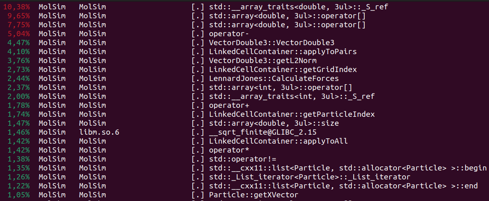

# Group D #
Members:
* Rodrigo Felix Forno
* Klára Možná
* Rayen Manai

# Code #
* Link:     https://github.com/klaramozna/PSEMolDyn_GroupD
* Branch:   main
* Revision: 
* Compiler: g++ 11.4.0
* Documentation: https://klaramozna.github.io/PSEMolDyn_GroupD/


# Report #
## Task 1 “Thermostats” ##
* We created a general ```Thermostat``` that implements some of the functionalities that thermostats have in common, such as calculating kinetic energy or calculating current temperature
* We decided not to store a reference to the particles of the ```LinkedCellContainer``` in the thermostat. On one hand doing this would spare us some copying of the particles back and forth in each iteration. However, it would require us to keep track of when ```LinkedCellContaine```r and ```Thermostat``` are deleted and used, such as it does not come to any memory problems. We decided to try to make our code less error-prone and increase maintainability by using copies instead of references. In each iteration, we update the state of the thermostat by calling the function ```updateState``` in ```Thermostat```. This is costly as we need to copy all particles twice per iteration (once with ```getParticleVector``` and then with ```updateState```). We might change this later when we optimize. 
* We implemented three types of Thermostats. The simple and gradual thermostat, as described in the worksheet. We also have another subclass, ```FakeThermostat```. This class does not implement any functionality. It simply overrides the functions of ```Thermostat``` with functions, that do not do anything. We decided that this will make our code in the ```Simulation``` class simpler and easier to read, compared to having many if conditions that check whether a thermostat is present or not.

## Task 2 “Simulation of the Rayleigh-Taylor instability” ##
### Periodic Boundaries: ###
  
### Gravity Force: ### 
* The gravity Force is a single particle force so it was not possible to implement it as a subclass of ForceCalculation.h like Lennard Jones. So we added a new parent class ```OneParticleForceCalculation``` and implemented ```GravityForce``` as a subclass of it, the method offered by this class will then be used in the Simulation class wrapped with the applyToAll functionality in every iteration.
* We support also this new routine through the XML input. The gravity factor is intialized with 0 so that this force has no effect if the user does not specify it. The user can overwrite this value with the XML input. The syntax is the following ``` <gravity> gravity factor value </gravity> ```

### Mixing rules: ### 
* We created a new class ```MixingRuleLennardJones``` that is used when multiple types of liquids interact with each other. We extended ```SphereGenerator``` and ```CuboidGenerator``` with the ability to optionally set the sigma and epsilon parameters of the liquids. Those values also have default values (1.0 for both) in order for the classes to be compatible with the rest of the project.

## Task 3 “Simulation of a falling drop - Liquid” ##
### Checkpointing ###

* To store checkpoints, we used the serialization functionality provided by XSD CodeSynthesis (```xsd cxx-tree --std c++11 --generate-doxygen --hxx-suffix .h --cxx-suffix .cpp  --generate-serialization ../../input/checkpointFormat.xsd ```), which generates C++ classes from an XML Schema Definition (XSD). Our approach involves defining a structured XSD format specifically for checkpoint data representation (```input/checkpointFormat.xsd```). This schema outlines the structure, elements, and data types expected within a checkpoint file (which is a sequence of particles to save the complete state of the molecules to the file, including old force, type, and so on). 
* We then utilize the generated C++ classes to serialize checkpoint data into XML format, adhering to the defined schema. This serialization ensures that the produced XML files comply with the specified format, enabling easy storage, exchange, and readability of checkpoint information.
* We added command line options to give the user the possibility to use this feature. These are explained in the repository README.
* Example Usage: Liquid Equilibration: run the program so to store the checkpoint after the liquid equilibrates in an xml file to load in next simulation   
  ```./src/MolSim -p ../input/WS4/T3-gravity-equi.xml -c ../input/Checkpoints/Checkpoint1.xml```  


https://github.com/klaramozna/PSEMolDyn_GroupD/assets/101558922/be2fdf83-d90f-40dc-b699-5ebfce15e9ff


* Sphere Drop accelerated by the gravity on the equilibrated liquid: run the program so to load the checkpoint and enter the sphere:  
  ```./src/MolSim -p ../input/WS4/T3-sphere.xml -x ../input/Checkpoints/Checkpoint1.xml``` 

### Optional ### 
* to do

## Task 4 “Performance Measurement and Profiling” ##

* With the profiling tool perf we used the following command to retrieve various performance metrics collected during the program's execution.
``` perf stat -o summary.txt -e cpu-cycles,cache-misses,cache-references ./src/MolSim p ../input/fallingdrop_Wall.xml -t True ```  

Results:  
```# started on Tue Dec 19 18:05:19 2023


 Performance counter stats for './src/MolSim -p ../input/fallingdrop_Wall.xml -t True':

   288.977.433.085      cpu_core/cpu-cycles/                                                    (99,96%)
   236.150.253.622      cpu_atom/cpu-cycles/                                                    (0,04%)
         3.280.184      cpu_core/cache-misses/                                                  (99,96%)
        29.063.767      cpu_atom/cache-misses/                                                  (0,04%)
        11.522.469      cpu_core/cache-references/                                              (99,96%)
       184.805.235      cpu_atom/cache-references/                                              (0,04%)

      71,814849566 seconds time elapsed

      71,682916000 seconds user
       0,027987000 seconds sys
```  
Interpretation:  
* It is clear that the program utilizes heavily the CPU as we are performing many calculations during many iterations.
* Ratio of Cache Misses to Cache References: Cache references represent the total number of times the CPU accesses the cache memory, while cache misses occur when the CPU cannot find the needed data or instructions in the cache, resulting in a need to fetch the information from a slower memory level like RAM, impacting the program's speed due to increased latency.
From the stats we can derive an average ```ratio of cache misses to cache references``` between the CPU core and CPU atom of approximately ```22%```. This ratio isn't extremely high but still it is a potential room for optimization to reduce cache miss rates and further enhance performance.  
  
Which parts of the code consume the most runtime?  

* We used the ```perf``` profiler with the falling drop simulation to find out where our code needs more optimizations. The results were the following: (the picture bellow only includes functions with time percentages above 1%)

* The most time by far was consumed by different array operations. This was expected, as most of the attributes that are simulated (velocity, position, force) are stored in arrays. Those attributes are accessed and changed many times for each particle in every iteration.
* Next comes the ```VectorDouble``` constructor. We use ```VectorDouble``` to perform operations on vectors, such as addition, scaling, calculating distances or norms etc. Each time we want to do an operation on a particle attribute. We need to create a ```VectorDouble``` that corresponds to the attribute of particle, as the particle are stored as arrays and not as ```VectorDouble```. These operations, again, are perform many times for each particle in each iteration.
* Another function that needs a lot of time is ```applyToPairs```. This is not too surprising as we need to iterate through many combinations of pairs of particles each iteration to calculate the forces. It might also be caused be the many index calculations (for example with the function getGridIndex() that also take up a lot of time).
* The ```getL2Norm``` function is a candidate for optimization as well. The high time spent in this function is probably due to the square root computation and generally being used many times in an iteration.

## Task 5 “Tuning the sequential Performance” ##  

* 
  
# Misc #

### Pending WS3 ### 
* Falling Drop Simulation:
  


https://github.com/klaramozna/PSEMolDyn_GroupD/assets/101558922/270aacd1-1df2-4ef6-997c-75fba459e1a4


https://github.com/klaramozna/PSEMolDyn_GroupD/assets/101558922/8e781b10-7655-4623-b6b6-fd95094c5686

### CL arguments vs XML parameters Periority ###
* We omitted the default parameters from WS1 that came with the command line arguments because they are no longer compatible and relevant for the simulations we do now, the default values should be provided through the xml files that we provide. That means now when the user starts the program with an xml file that we provide or a file the user writes compatible to our syntax ```/input/simulationFormat.xsd``` then the default values will be read from there. But we gave then periority to the command line arguments to allow the user to overwrite certain parameters in a fast way. Parameters (like end_time, delta_t, log level or force used ...) that were passed through command line arguments have periority over the ones from the provided xml file.


