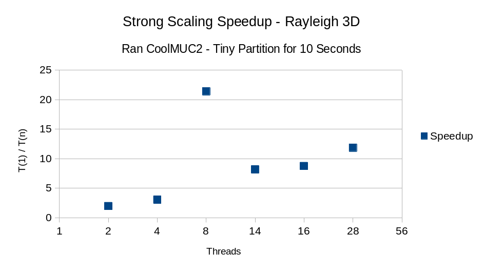
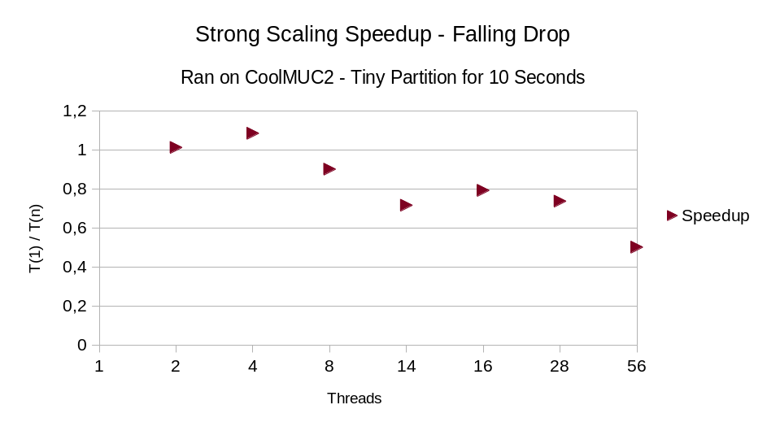

# Group D #
Members:
* Rodrigo Felix Forno
* Klára Možná
* Rayen Manai

# Code #
* Link:     https://github.com/klaramozna/PSEMolDyn_GroupD
* Branch:   main
* Revision: 
* Compiler: g++ 11.4.0
* Documentation: https://klaramozna.github.io/PSEMolDyn_GroupD/


# Report #
## Task 1 ”Simulation of a membrane” ##
* We chose the option to extend the particle class over the choice of having a seperate class for membranes to easily intergrate the functionality with the linked cell container and avoid some refactoring work.
* We extended the particle class to support attributes like average bond length, stiffness, parallel/diagonal neighbors, a particle id and a flag to mark if the hard coded pull force will be applied to this  particle or not.
* We store the neighbours in a vector of shared pointers so that the pointers don't change when we give the particles back fron the membranegenerator to the container.
* We implemented a membrane Generator which will complete the following tasks: 
1- generate a cuboid with the parameters given in the input file, and if present mark the particles with the flag if the pull force is activated on them
2- initialize the neighbours vectors of each particle: for that we have two helper functions ``` calculateParallelNeighbourIndices ```  and ```calculateDiagonalNeighbourIndices``` that hold the logic of calculating the neighbours of each particle, and counting for the edge cases.  
The basic idea of these two methods can be seen in the following presentation:  
  

* The harmonic forces were integrated into the simulation.cpp file, where this method will be applied on all the particles each iteration.
* To avoid self-penetration, we implemented the TruncatedLennardJones forces, the xml input datei allows to specify this type of force which is just the repulsive part of the LennardJones Potential.
* We also managed to give the user the ability to specify in the input file exactly the end time of the "hardcoded" pull force, on which particles will it be applied and with which factors, an example of this syntax can be seen in the file /input/WS5/membrane.xml.  
  


#### Tests #####
* To test that the neighbours are correctly intialised we wrote tests in ```MembraneGeneratorTest.cpp```, that generate a 3*3 Membrane and then check all neighbours of all 9 particles.
* In ```MembraneForcesTest.cpp``` we tested some values of one iteration of Harmonic Forces against hand calculated values, as well as for Truncated (repulsive) Lennard Jones.

#### Simulation #####
* When we run the simulation with the provided parameters in the worksheet(```input/WS5/membrane.xml```), the simulation explodes quickly and we lose all particles. This can be because of some follow-up errors. That's why we had the tests of membrane as some proof of concept which seem to work fine.
* When we run the simulation with some other parameters (especially smaller time step delta_t), we got the following simulation:
  

https://github.com/klaramozna/PSEMolDyn_GroupD/assets/101558922/2a9c04d2-9240-4e43-9038-ed21da9da1a5


## Task 2 ”Parallelization” + Task 3 "Rayleigh-Taylor in 3D" ##

### Starting with OpenMP ###
* Introduces parallel blocks and thread management. The first approach tried as heavily based around the fork-join model, which is a data-centric approach to parallelization.
* A more naive first implementation is straightforward enough, with a collapse loop over the 3 dimensions of the domain over each cell, but has scalability issues and data inconsistency on the particles

### Literature Review ###
* We then did a literature review to find out how to best parallelize the application, and found that the best approach would be to use a domain decomposition approach, where each thread is responsible for a locally adjacent set of cells.

Examples of literature can be found at

1. Chapter 4 of the book "Numerical Simulation in Molecular Dynamics: Numerics, Algorithms, Parallelization, Applications" by Michael Griebel, Stephan Knapek, and Gerhard Zumbusch
2. D. Beazley and P. Lomdahl, Message-passing multi-cell molecular dynamics on the Connection Machine 5, Parallel Comp., 20 (1994), pp. 173–195.
3. S. Gupta, Computing aspects of molecular dynamics simulations, Comp.
   Phys. Comm., 70 (1992), pp. 243–270.

### Approaches ###
With this in mind, we opted for

1. Domain Decomposition
2. Disjoint iteration over cells

### Critical Sections ###
* To fix the complications found in the first implementation, we used critical sections to ensure that only one thread can access a given cell at a time
* This implementation is however severely limited since we found the application to be memory bound, meaning that most time spent on the critical section was writing to memory.

### Naive Locking ###
* To improve the parallelism of the application, we then implemented cell-wide locking, where each cell has a lock that is acquired before reading or writing to the cell.
* This implementation is much more scalable, but still has issues with deadlocks. This has taken a lot of development time, since at the time, we weren't aware of techniques to break lock conditions
* Much time was spent figuring out why and how locking was happening and how to fix it. Not only that, but performance was suffering as well
* To look for solutions, ```Helgrind``` and ```perf``` were used to find out where the bottlenecks and data conflicts were, which was unfortunately not of much help.
* After using a toy example, we were able to find that the unordered locking during neighbour pairwise force calculation was causing deadlocks.

### Sort and Lock ###
To solve this problem, we implemented a sort and lock approach, where we sort the cells by their index, and then lock them in order. This ensures that no deadlocks can occur, since the locks are always acquired in the same order.

### Considerations on memory locality ###
* At the beginning of this last sprint, we were still having performance issues, and we found that the main bottlenecks were memory locality and lock contention
* To solve memory locality, we implemented thread-local storage for the cells and reduction like task loops for completely disjoint operations (such as applyToAll)
* This helped some with cache misses, but was later scratched due to the choice of using shared pointers for the particles, meaning that local copies wouldn't be deep/couldn't easily be rewritten onto the global copy.

### Running on the cluster ###
We then performed the Rayleigh 3D experiment on the cluster, obtaining results which can be seen on the video linked together with the report. The video shows the simulation running fine for the first ~10 seconds, but then a reasonable number of particles get deleted. The reason for this behaviour was unfortunately not further explored

Below are the results of a 10 second run on the cluster, with different thread counts.



As you can see, there is more or less a linear relation at the beginning of the (strong scaling) graph, but with increasing threads, the speed up starts dropping of,
as indicates Amdahl's law. We found out that 8 threads however had a disproportionally high speedup, which we could not quite explain.

For comparison reasons, we did the same experiment on the falling drop simulation, which is highly heterogeneous, and obtained the following results:



And to answer the question of the worksheet, we see that the type of job influences how much speed up we can get from parallelization. A simulation such as the falling drop is very heterogeneously distributed, meaning that the speed up is limited by the sequential part of the code. On the other hand, the Rayleigh 3D simulation is very homogeneously distributed, meaning that the speed up is limited by the parallel part of the code.

## Task 4 ”Nano-scale flow simulation (Option A)” ##
* First, we implemented the new thermostat, based on temperature differences as a subclass of our ```Thermostat``` class.
* In order to be able to create the walls, we added an attribute ```isWall``` to our ```Particle``` class. When this attribute is set, none of the setters work - meaning that once a wall particle is initialized with a position, velocity and force, it can no longer be changed. We also added support for this in the xml file.
* We created the ```ParticleStatistics``` class that is responsible for calculating the average velocity and density in each bin and writing them to a CSV file. Each value in the file has the following format: ```iteration_[number of iteration]-bin_[number of bin]-[type of value]:[value]```. The numbers of the bins go from top to bottom, so bin 0 is the uppermost one. If the type of the value is velocity, the velocities in each direction are separated by a ```|```.

### Studying influences ###
* Mass: The original mass of the liquid particles was 1.0. To find out more about the influence of mass on the simulation, we first reduced it to 0.1 and then increased to 3.0. We expected the particles in the simulation with mass 0.1 to be a lot faster than in the simulation with particles of mass 3.0, because the force required to move a heavier particle is larger, causing it to slow down. However, we have not found this to be the case. The average velocity varied a lot between iterations and in some of the iterations, the 3.0 mass particles were faster, in other cases, it was the other way around. This results is likely caused by the thermostat, that regulates the temperature. Even if the particles with mass 0.1 are faster, they will still be cooled down quickly by the thermostat.
* Spheres in the liquid: Next, we tried placing a small sphere (not fixed) with a radius of one in the middle of the liquid. We initially left the parameters (mass, sigma, epsilon etc.) the same as in the rest of the liquid. The effect of this was not very prominent. We did observe a small turbulence in the place where the sphere was placed, but the simulation quickly returned to its original state. To make the effect of the sphere larger by increasing the radius of the sphere to 3.0, multiplying its volume by more than 20. This made the effect significantly stronger. The area where the sphere was placed has way less dense than the rest of the simulation a few seconds after starting. We also tried increasing the mass of the sphere particles from 1.0 to 3.0, but this made barely any change.
* Thermostats: We compared two types of thermostats, the new thermostat based on temperature differences and the old simple thermostat (not gradual). In the beginning iterations, the velocities in both simulations were nearly identical. In the later iterations, there are some minor differences, but the velocities remained very similar until the end of the simulation. This is caused by the fact that both of these thermostats work in exactly the same way. They both bring the temperature as close as possible to the target temperature in a single iteration, so it was to be expected for the results to be similar.
* Sigma: We tried reducing sigma of the liquid to 0.1 and then increasing it to 3.0. With sigma at 3.0, the average velocities got extremely high very quickly (in the span of millions, usually the values are between 0 and 5). With the low sigma of 0.1, the velocities initially have typical values, but later turn to zero (than does not mean the particles don't move, it could also be that velocities cancel each other out). What is also interesting is that with a sigma of 0.1, the walls can no longer hold in the liquid. Some of the liquid particles go through the walls and exit the domain.
* Epsilon: Next, we did the same with epsilon. First decreased to 0.1 and then increased it to 3.0. Surprisingly, despite these being very large changes, not a lot changed, visually or in terms of the velocity profiles.
* Removing the walls: We also tried removing both of the walls, but let the liquid the same. As soon as the simulation starts, the liquid expands to the sides to fit the entire domain and distribute themselves equally across the domain. The rest of the simulation looks very similar to how it is with the walls, but wider. Density is lower, as the particles have more space to move around.

https://github.com/klaramozna/PSEMolDyn_GroupD/assets/101558922/9114c752-507f-451b-ae8c-396a3f36a02d


## Task 5 ”Crystallization of Argon (Option B)” ##
* We also tried to implement this task (see branch ```task5_v2```)because we had good working periodic boundaries and checkpointing feature.
* We implemented the smoothed Lennard Jones forces which reuses the mixing rules lennard Jones for the suitable case and implements the other formulas for the other cases. 
(file: ```Simulation/Physics/SmoothedLennardJones.cpp``` ).
* When trying to run this simulation with the given parameters it also exploded after some time, running it with a bigger domain overcomes that problem but the result simulations were not what was intented from the task. 

# Misc #
* We did a lot of refactor work to be able to integrate the new functionalities of this worksheet:

#### Solve dependency between ParticleReader and ParticleContainer ####
* We had from previous implementations the design flaw that caused a circular dependeny between ParticleReaders (for example the XMLReader) and the ParticleContainer (for example LinkedCellContainer): the problem was that the method readFile expects a ParticleContainer as argument and then fills that container with the particles read from the file, this was problematic because the linked cell container can first be instantiated after reading the needed parameters for it from readFile (like size, boundaries, cutoff radius ...), we avoided that before with some workarounds but now we fixed the design by breaking this dependency: ParticleReaders now have an intern vector of shared pointers to the Particles, when readFile is called the vector is filled with the read particles (+ of course simulation parameters are stored in SimParameters) and then when we instantiate the LinkedCellContainer for example we call getParticles from the reader to get the vector of particles and add them to the container.


#### Simulation Iterations to the right place #####
* Before we had the simulation iterations logic in the main file (MolSim.cpp), this was clearly a bad design and also made it hard to integrate the membrane implementation (the pull force), because in the Simulation class we would we need to keep track of the current time to know if this pull force is still active or not (as it has a different end time then the whole simulation).
* We made the needed refactor to move all the simulation Logic to the Simulation Class.

### Pending Worksheet 4 ###
* After fixing some typo mistakes (for example when generating a disk we were hard coding the z coordinate and not reading it from the input file), the simulation of the falling drop and the equilibrated liquid (checkpoint) worked fine for the most time but it exploded at the very end (as you can see in the following simulation video):


https://github.com/klaramozna/PSEMolDyn_GroupD/assets/101558922/508df741-f059-4ca1-8c43-7fdb5d14f1cd


