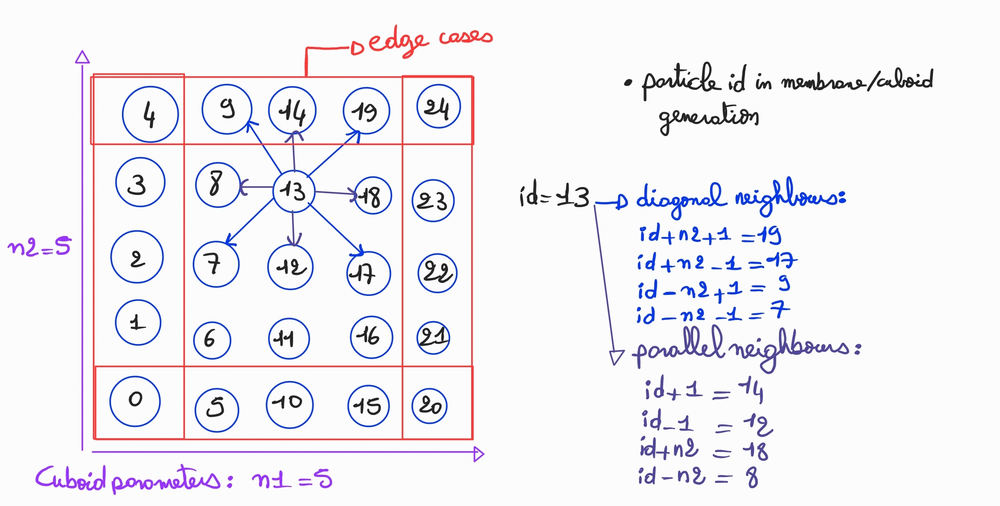
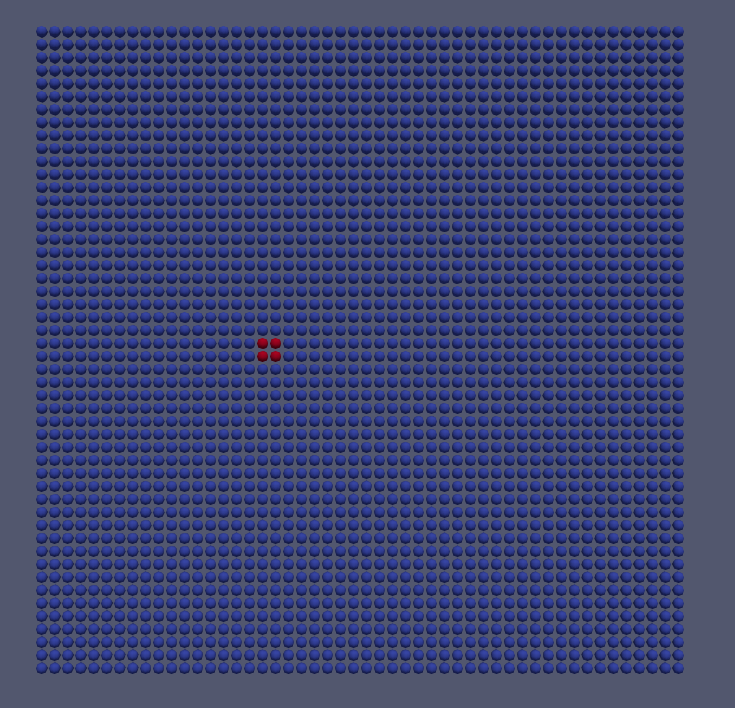

# Group D #
Members:
* Rodrigo Felix Forno
* Klára Možná
* Rayen Manai

# Code #
* Link:     https://github.com/klaramozna/PSEMolDyn_GroupD
* Branch:   main
* Revision: 
* Compiler: g++ 11.4.0
* Documentation: https://klaramozna.github.io/PSEMolDyn_GroupD/


# Report #
## Task 1 ”Simulation of a membrane” ##
* We chose the option to extend the particle class over the choice of having a seperate class for membranes to easily intergrate the functionality with the linked cell container and avoid some refactoring work.
* We extended the particle class to support attributes like average bond length, stiffness, parallel/diagonal neighbors, a particle id and a flag to mark if the hard coded pull force will be applied to this  particle or not.
* We store the neighbours in a vector of shared pointers so that the pointers don't change when we give the particles back fron the membranegenerator to the container.
* We implemented a membrane Generator which will complete the following tasks: 
1- generate a cuboid with the parameters given in the input file, and if present mark the particles with the flag if the pull force is activated on them
2- initialize the neighbours vectors of each particle: for that we have two helper functions ``` calculateParallelNeighbourIndices ```  and ```calculateDiagonalNeighbourIndices``` that hold the logic of calculating the neighbours of each particle, and counting for the edge cases.  
The basic idea of these two methods can be seen in the following presentation:  
  

* The harmonic forces were integrated into the simulation.cpp file, where this method will be applied on all the particles each iteration.
* To avoid self-penetration, we implemented the TruncatedLennardJones forces, the xml input datei allows to specify this type of force which is just the repulsive part of the LennardJones Potential.
* We also managed to give the user the ability to specify in the input file exactly the end time of the "hardcoded" pull force, on which particles will it be applied and with which factors, an example of this syntax can be seen in the file /input/WS5/membrane.xml.  
  


## Task 2 ”Parallelization” + Task 3 "Rayleigh-Taylor in 3D" ##

### Starting with OpenMP ###
* Introduces parallel blocks and thread management. The first approach tried as heavily based around the fork-join model, which is a data-centric approach to parallelization.
* A more naive first implementation is straightforward enough, with a collapse loop over the 3 dimensions of the domain over each cell, but has scalability issues and data inconsistency on the particles

### Literature Review ###
* We then did a literature review to find out how to best parallelize the application, and found that the best approach would be to use a domain decomposition approach, where each thread is responsible for a locally adjacent set of cells.

Examples of literature can be found at 

1. Chapter 4 of the book "Numerical Simulation in Molecular Dynamics: Numerics, Algorithms, Parallelization, Applications" by Michael Griebel, Stephan Knapek, and Gerhard Zumbusch
2. D. Beazley and P. Lomdahl, Message-passing multi-cell molecular dynamics on the Connection Machine 5, Parallel Comp., 20 (1994), pp. 173–195.
3. S. Gupta, Computing aspects of molecular dynamics simulations, Comp.
   Phys. Comm., 70 (1992), pp. 243–270.

### Approaches ###
With this in mind, we opted for

1. Domain Decomposition
2. Disjoint iteration over cells

### Critical Sections ###
* To fix the complications found in the first implementation, we used critical sections to ensure that only one thread can access a given cell at a time
* This implementation is however severely limited since we found the application to be memory bound, meaning that most time spent on the critical section was writing to memory.

### Naive Locking ###
* To improve the parallelism of the application, we then implemented cell-wide locking, where each cell has a lock that is acquired before reading or writing to the cell.
* This implementation is much more scalable, but still has issues with deadlocks. This has taken a lot of development time, since at the time, we weren't aware of techniques to break lock conditions
* Much time was spent figuring out why and how locking was happening and how to fix it. Not only that, but performance was suffering as well
* To look for solutions, ```Helgrind``` and ```perf``` were used to find out where the bottlenecks and data conflicts were, which was unfortunately not of much help.
* After using a toy example, we were able to find that the unordered locking during neighbour pairwise force calculation was causing deadlocks.

### Sort and Lock ###
To solve this problem, we implemented a sort and lock approach, where we sort the cells by their index, and then lock them in order. This ensures that no deadlocks can occur, since the locks are always acquired in the same order.

### Considerations on memory locality ###
* At the beginning of this last sprint, we were still having performance issues, and we found that the main bottlenecks were memory locality and lock contention
* To solve memory locality, we implemented thread-local storage for the cells and reduction like task loops for completely disjoint operations (such as applyToAll)
* This helped some with cache misses, but was later scratched due to the choice of using shared pointers for the particles, meaning that local copies wouldn't be deep/couldn't easily be rewritten onto the global copy.

### Running on the cluster ###
We then performed the Rayleigh 3D experiment on the cluster, obtaining the following results:
<This is where the graph comes in>

As you can see, there is more or less a linear relation at the beginning of the graph, but with increasing threads, the speed up starts dropping of,
as indicates Amdahl's law.

And to answer the question of the worksheet, we see that the type of job influences how much speed up we can get from parallelization. A simulation such as the falling drop is very heterogeneously distributed, meaning that the speed up is limited by the sequential part of the code. On the other hand, the Rayleigh 3D simulation is very homogeneously distributed, meaning that the speed up is limited by the parallel part of the code.

## Task 4 ”Nano-scale flow simulation (Option A)” ##
* 

https://github.com/klaramozna/PSEMolDyn_GroupD/assets/101558922/9114c752-507f-451b-ae8c-396a3f36a02d


## Task 5 ”Crystallization of Argon (Option B)” ##

  
# Misc #
* We did a lot of refactor work to be able to integrate the new functionalities of this worksheet: TODO

